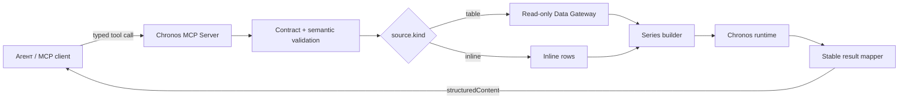

# Техническое задание: Chronos MCP Server

Статус: Draft  
Версия контракта: `1.0`  
Дата: 2026-07-23  
Целевой MCP server id: `chronos`

## 1. Цель

Создать отдельный MCP-сервер для прогнозирования временных рядов через библиотеку
`chronos-forecasting`.

Сервер должен убрать из прогнозного контура свободный текст, LLM-генерацию SQL,
передачу DB/LLM credentials в predict-service и неявные reverse callback.
Агент должен вызывать typed tools и передавать явно:

- источник данных;
- колонку времени;
- одну или несколько метрик;
- разбиение на отдельные ряды;
- структурированный фильтр;
- частоту;
- горизонт;
- политику пропусков;
- квантили и разрешенную модель.

MCP-сервер обязан валидировать запрос и подготовленный ряд до запуска модели,
а затем вернуть стабильный машинно-читаемый результат.

MCP меняет качество и наблюдаемость интеграции, но не улучшает точность Chronos
сам по себе. Качество прогноза проверяется отдельным backtest tool.

## 2. Критерии успеха

Сервер считается полезным, если:

1. Агент строит прогноз без свободного SQL и без natural-language `question`.
2. Ошибки данных возвращаются как typed MCP tool errors, а не как необъяснимый
   HTTP 500.
3. Ответ `forecast` всегда содержит ключи `rows`, `intervals`, `plot`,
   `warnings`, `model_meta` и `data_meta`.
4. `horizon=1` всегда возвращает массив из одной строки на каждый ряд и target,
   а не scalar.
5. Один контракт поддерживает:
   - univariate forecast;
   - batch forecast для нескольких рядов;
   - несколько targets;
   - past и known-future covariates, если это поддерживает выбранная модель;
   - quantile forecast;
   - table и inline input.
6. Агент может выполнить backtest и не выдавать прогноз без измерения качества,
   когда пользователь просит оценить надежность.
7. Сервис переиспользуется любым MCP-клиентом, а не только
   `llm-data-analyst`.

Целевые эксплуатационные показатели для warm model:

- tool validation без чтения данных: p95 не более 100 ms;
- подготовка ряда до 100 000 исходных строк: p95 не более 5 s без учета
  внешней БД;
- inference timeout: конфигурируемый, по умолчанию 120 s;
- необработанные exception: менее 0.1% вызовов;
- все tool errors имеют стабильный `error.code`.

## 3. Scope v1

### Входит

- Chronos-2 как default model family.
- Разрешенные администратором Chronos, Chronos-Bolt и Chronos-2 models.
- Forecast из table source и inline rows.
- Batch, multi-target, dynamic past covariates и known-future covariates.
- Point forecast и произвольные разрешенные quantiles.
- Детерминированная подготовка временного ряда.
- Backtest с rolling windows.
- Model/runtime capabilities.
- Plotly JSON без рендеринга изображения на сервере.
- Streamable HTTP transport; stdio разрешен только для локальной разработки.

### Не входит в v1

- LLM внутри MCP-сервера.
- Прием произвольного SQL, Python-кода, URL или файлового пути от агента.
- Передача DB password, API key, Hugging Face token или callback URL в tool
  arguments.
- Автоматический выбор таблицы, даты, метрики, фильтра или бизнес-смысла ряда.
- Автоматическое заполнение пропусков без явно указанной политики.
- Скачивание произвольной модели по имени, которое прислал агент.
- Fine-tuning, model promotion и удаление checkpoint.
- Возврат embeddings в LLM context.

Под «полным доступом агента к Chronos в v1» понимается полная прикладная
inference-поверхность, а не зеркалирование каждого Python-метода библиотеки.
Fine-tuning требует отдельной очереди заданий, квот и model registry и может
быть добавлен как v2 после появления реального сценария.

## 4. Архитектура и зависимости



Обязательные свойства:

- направление доступа к данным одно: MCP server -> Data Gateway;
- адрес и service credential Data Gateway задаются при deployment, а не в tool
  call;
- `connection_id` является opaque reference, по которому Data Gateway проверяет
  tenant/user access и получает credentials из своего secret store;
- Chronos runtime не знает о SQL, MCP transport и пользовательской авторизации;
- SQL строится только детерминированным compiler из typed contract;
- transport handler не содержит логику подготовки ряда или модели.

Не требуется создавать универсальный query engine. В первой реализации нужны
только PostgreSQL table source и inline rows. DuckDB/CSV подключается через
inline rows либо добавляется вторым явно протестированным dialect.

## 5. MCP transport

- Production endpoint: `POST /mcp`, transport `streamable_http`.
- Dev transport: `stdio`.
- MCP tools публикуют `inputSchema` и `outputSchema`.
- Успех возвращается одновременно:
  - в `structuredContent`;
  - в коротком `TextContent` с сериализованным JSON для совместимости клиентов.
- Исправимая ошибка входа/данных/модели возвращается как tool result с
  `isError=true`, а не как protocol error.
- Protocol error используется только для неизвестного tool, невалидного
  JSON-RPC или сломанной MCP-сессии.

Tool annotations для всех трех v1 tools:

```json
{
  "readOnlyHint": true,
  "destructiveHint": false,
  "idempotentHint": true,
  "openWorldHint": false
}
```

## 6. Набор tools

| MCP tool | Tool key в текущем `llm-data-analyst` | Назначение |
|---|---|---|
| `forecast` | `mcp__chronos__forecast` | Подготовить ряд и построить прогноз |
| `backtest` | `mcp__chronos__backtest` | Оценить модель на исторических окнах |
| `capabilities` | `mcp__chronos__capabilities` | Показать модели, возможности и лимиты |

Отдельные `validate`, `plot` и `health` tools не создаются:

- validation является обязательной частью `forecast` и `backtest`;
- plot строится из уже рассчитанных rows;
- health/readiness относятся к infrastructure endpoints, а не к действиям
  агента.

## 7. Общие типы

### 7.1 `Source`

#### Table source

```json
{
  "kind": "table",
  "connection_id": "demo-postgres",
  "schema": "analytics",
  "table": "monthly_sales"
}
```

| Поле | Тип | Обязательное | Правило |
|---|---|---:|---|
| `kind` | `"table"` | да | Discriminator |
| `connection_id` | string | да | Opaque id, 1-128 символов |
| `schema` | string | да | Должна существовать и быть разрешена |
| `table` | string | да | Должна существовать и быть разрешена |

#### Inline source

```json
{
  "kind": "inline",
  "rows": [
    {"ts": "2026-01-01", "series": "a", "y": 10.0},
    {"ts": "2026-02-01", "series": "a", "y": 12.0}
  ]
}
```

| Поле | Тип | Обязательное | Правило |
|---|---|---:|---|
| `kind` | `"inline"` | да | Discriminator |
| `rows` | array<object> | да | 2..50 000 rows, не более 5 MiB JSON |

`NaN`, `Infinity` и `-Infinity` запрещены в обоих вариантах. В JSON допустимы
только конечные numbers или `null`.

### 7.2 `Target`

```json
{
  "name": "revenue",
  "column": "amount",
  "aggregation": "sum"
}
```

| Поле | Тип | Обязательное | Правило |
|---|---|---:|---|
| `name` | string | да | Стабильное имя target в результате |
| `column` | string/null | условно | Обязательно, кроме `aggregation=count` |
| `aggregation` | enum | да | `none`, `sum`, `mean`, `median`, `min`, `max`, `count`, `count_distinct`, `last` |

`aggregation=none` разрешена только когда на один
`series_id + timestamp + target` приходится не более одного значения.

### 7.3 `FilterExpr`

Raw SQL запрещен. Фильтр задается рекурсивным AST.

Логическая группа:

```json
{
  "op": "and",
  "args": [
    {"column": "region", "op": "eq", "value": "Moscow"},
    {"column": "status_id", "op": "in", "values": [1, 2]}
  ]
}
```

Разрешенные логические операции: `and`, `or`, `not`.

Разрешенные predicates:

| `op` | Поля |
|---|---|
| `eq`, `ne`, `gt`, `gte`, `lt`, `lte` | `column`, `value` |
| `in`, `not_in` | `column`, `values` |
| `between` | `column`, `lower`, `upper` |
| `is_null`, `not_null` | `column` |

Ограничения:

- глубина AST не более 5;
- predicates не более 50;
- `in/not_in` не более 100 значений;
- колонка проверяется по реальной schema таблицы;
- значение приводится только безопасным преобразованием к типу колонки;
- строка `"NaN"` не является числом и отклоняется для numeric/smallint columns;
- SQL values передаются только bind parameters;
- schema/table/column identifiers берутся из проверенного каталога и
  экранируются по dialect.

## 8. Tool `forecast`

### 8.1 Input

```json
{
  "request_id": "fc_01J...",
  "source": {
    "kind": "table",
    "connection_id": "demo-postgres",
    "schema": "analytics",
    "table": "operator_events"
  },
  "time_column": "event_date",
  "targets": [
    {
      "name": "terminations",
      "column": "employee_id",
      "aggregation": "count"
    }
  ],
  "series_id_columns": ["department"],
  "filter": {
    "op": "and",
    "args": [
      {"column": "event_type", "op": "eq", "value": "termination"},
      {"column": "event_date", "op": "not_null"}
    ]
  },
  "history_start": "2024-01-01",
  "history_end": "2026-06-30",
  "horizon": 3,
  "frequency": "month_start",
  "timezone": "UTC",
  "missing_policy": "zero",
  "quantiles": [0.1, 0.5, 0.9],
  "model_alias": "chronos2-default",
  "covariates": {
    "past_columns": ["avg_workload"],
    "future_columns": ["planned_headcount"]
  },
  "options": {
    "point_forecast": "median",
    "include_plot": true,
    "max_history_points": 2048,
    "cross_learning": false
  }
}
```

#### Верхнеуровневые поля

| Поле | Тип | Обязательное | Default/ограничение |
|---|---|---:|---|
| `request_id` | string/null | нет | Генерируется сервером, если отсутствует |
| `source` | `TableSource \| InlineSource` | да | Только описанные source kinds |
| `time_column` | string | да | Date/datetime/timestamp или parseable ISO string для inline |
| `targets` | array<Target> | да | 1..16 |
| `series_id_columns` | array<string> | нет | `[]`, не более 8 |
| `filter` | FilterExpr/null | нет | Только для `table` |
| `history_start` | ISO date/datetime/null | нет | Inclusive |
| `history_end` | ISO date/datetime/null | нет | Inclusive; не позже текущего времени без явного future-covariate режима |
| `horizon` | integer | да | 1..server limit, в периодах `frequency` |
| `frequency` | enum | да | Автоопределение в v1 запрещено |
| `timezone` | IANA timezone | нет | `UTC` |
| `missing_policy` | enum | да | `error`, `zero`, `forward_fill`, `interpolate` |
| `quantiles` | array<number> | нет | `[0.1, 0.5, 0.9]`; unique, sorted, `0 < q < 1` |
| `model_alias` | string | нет | Server-configured default; только allowlist |
| `covariates` | object/null | нет | Только для модели с соответствующей capability |
| `options` | object | нет | Без hardware/runtime credentials |

Разрешенные значения `frequency`:

`minute`, `hour`, `day`, `week_monday`, `week_sunday`, `month_start`,
`month_end`, `quarter_start`, `quarter_end`, `year_start`, `year_end`.

Aliases `M`, `MS`, `ME` и другие pandas offsets на входе запрещены. Это
устраняет неоднозначность начала/конца месяца.

`options`:

| Поле | Тип | Default | Правило |
|---|---|---|---|
| `point_forecast` | `median \| mean` | `median` | `mean` только если модель его возвращает |
| `include_plot` | boolean | `true` | При больших результатах plot может быть `null` с warning |
| `max_history_points` | integer/null | model default | 2..server limit; берутся последние points |
| `cross_learning` | boolean | `false` | Только Chronos-2 и несколько связанных рядов |

`covariates`:

| Поле | Тип | Default | Правило |
|---|---|---|---|
| `past_columns` | array<string> | `[]` | Значения должны покрывать history |
| `future_columns` | array<string> | `[]` | Значения должны покрывать ровно требуемый future horizon |

Для table source known-future covariates читаются из той же таблицы для
периодов после последнего ненулевого target. Для inline source future rows
передаются в `source.rows` с `target=null`. Отсутствие хотя бы одного future
period возвращает `FUTURE_COVARIATES_INCOMPLETE`.

### 8.2 Success output

Все верхнеуровневые ключи обязательны. Nullable value возвращается как `null`,
а не исчезает из JSON.

```json
{
  "schema_version": "1.0",
  "status": "ok",
  "request_id": "fc_01J...",
  "rows": [
    {
      "series_id": {"department": "support"},
      "target": "terminations",
      "ts": "2026-07-01T00:00:00Z",
      "prediction": 21.4,
      "lower": 17.8,
      "upper": 25.9,
      "quantiles": {
        "0.1": 17.8,
        "0.5": 21.4,
        "0.9": 25.9
      }
    }
  ],
  "intervals": [
    {
      "name": "q0.1_q0.9",
      "lower_quantile": 0.1,
      "upper_quantile": 0.9,
      "nominal_coverage": 0.8
    }
  ],
  "plot": {
    "format": "plotly",
    "figure": {
      "data": [],
      "layout": {}
    }
  },
  "warnings": [
    {
      "code": "SHORT_CONTEXT",
      "message": "Only 18 monthly observations were available.",
      "details": {"observations": 18}
    }
  ],
  "model_meta": {
    "library": "chronos-forecasting",
    "library_version": "2.2.0",
    "model_alias": "chronos2-default",
    "model_id": "amazon/chronos-2",
    "model_revision": "pinned-revision",
    "family": "chronos2",
    "capabilities": ["quantiles", "batch", "multitarget", "covariates"],
    "context_points": 18,
    "prediction_length": 3,
    "inference_ms": 412,
    "cached": true
  },
  "data_meta": {
    "source_kind": "table",
    "connection_id": "demo-postgres",
    "table": "analytics.operator_events",
    "time_column": "event_date",
    "targets": ["terminations"],
    "series_count": 1,
    "input_row_count": 280,
    "prepared_point_count": 18,
    "history_start": "2025-01-01T00:00:00Z",
    "history_end": "2026-06-01T00:00:00Z",
    "frequency": "month_start",
    "timezone": "UTC",
    "missing_periods": 0,
    "missing_policy": "zero",
    "query": {
      "sql": "SELECT ... WHERE event_type = :p1 ...",
      "parameter_count": 1,
      "fingerprint": "sha256:..."
    }
  }
}
```

#### Семантика результата

- `rows` всегда array.
- Количество rows при одном target:
  `series_count * horizon`.
- При нескольких targets:
  `series_count * target_count * horizon`.
- `ts` — RFC 3339 в указанной timezone, нормализованной в ISO representation.
- `prediction`, `lower`, `upper` — finite number или `null`.
- `lower` и `upper` соответствуют первой записи `intervals`.
- `quantiles` содержит все запрошенные quantiles с string keys.
- `plot` — `null`, если `include_plot=false` или превышен plot limit.
- `warnings` — array, в том числе пустой.
- `model_meta.model_revision` должен быть pinned commit/revision, а не `main`.
- SQL в `data_meta` содержит placeholders, но не sensitive parameter values.

### 8.3 Error output

```json
{
  "schema_version": "1.0",
  "status": "error",
  "request_id": "fc_01J...",
  "error": {
    "code": "FILTER_TYPE_MISMATCH",
    "message": "Filter value for status_id must be an integer.",
    "field": "filter.args[1].values[0]",
    "retryable": false,
    "details": {
      "column": "status_id",
      "expected": "smallint",
      "received_type": "string"
    }
  }
}
```

Required error codes:

| Code | Когда |
|---|---|
| `INVALID_ARGUMENT` | JSON соответствует MCP, но нарушает field constraint |
| `UNAUTHORIZED_SOURCE` | Нет доступа к `connection_id/schema/table` |
| `SOURCE_NOT_FOUND` | Источник не существует |
| `COLUMN_NOT_FOUND` | Нет time/target/filter/covariate column |
| `COLUMN_TYPE_MISMATCH` | Колонка не подходит по типу |
| `FILTER_TYPE_MISMATCH` | Filter value не соответствует типу колонки |
| `QUERY_REJECTED` | Compiler не смог построить безопасный SELECT |
| `QUERY_TIMEOUT` | Источник не ответил вовремя |
| `SERIES_EMPTY` | После фильтрации нет observations |
| `SERIES_TOO_SHORT` | Недостаточно context points |
| `DUPLICATE_PERIOD` | `aggregation=none` и есть duplicate period |
| `MISSING_PERIODS` | Есть gaps и `missing_policy=error` |
| `IRREGULAR_FREQUENCY` | Timestamps не соответствуют заданной frequency |
| `NON_FINITE_VALUE` | Target/covariate содержит NaN/Infinity |
| `FUTURE_TARGET_LEAKAGE` | В forecast input попали future target values |
| `FUTURE_COVARIATES_INCOMPLETE` | Нет known-future covariates на весь horizon |
| `MODEL_CAPABILITY_MISMATCH` | Модель не поддерживает requested mode |
| `MODEL_NOT_AVAILABLE` | Alias не загружен/не разрешен |
| `MODEL_INPUT_REJECTED` | Chronos отклонил shape/length после validation |
| `RESOURCE_EXHAUSTED` | Слишком большой input, queue или GPU memory |
| `INFERENCE_TIMEOUT` | Model inference превысил timeout |
| `INTERNAL_ERROR` | Непредвиденная ошибка; response содержит correlation id |

`details` не содержит credentials, raw rows, stack trace или secret paths.

## 9. Tool `backtest`

`backtest` использует те же поля source/time/targets/filter/frequency/model,
что и `forecast`, и добавляет:

```json
{
  "evaluation": {
    "horizon": 3,
    "windows": 4,
    "step": 1,
    "min_context_points": 18,
    "metrics": ["mae", "rmse", "smape", "mase", "wql"]
  }
}
```

Ограничения v1:

- `windows`: 1..20;
- `horizon`: 1..server limit;
- общий объем `series * targets * windows * horizon` не более configured limit;
- MAPE намеренно отсутствует: на нулевых фактах метрика нестабильна;
- если denominator для MASE недоступен, metric=`null` и возвращается warning.

Success output:

```json
{
  "schema_version": "1.0",
  "status": "ok",
  "request_id": "bt_01J...",
  "rows": [
    {
      "window": 1,
      "cutoff": "2026-03-01T00:00:00Z",
      "series_id": {"department": "support"},
      "target": "terminations",
      "ts": "2026-04-01T00:00:00Z",
      "actual": 20.0,
      "prediction": 18.7,
      "lower": 15.1,
      "upper": 22.4
    }
  ],
  "metrics": {
    "overall": {
      "mae": 1.8,
      "rmse": 2.2,
      "smape": 0.09,
      "mase": 0.84,
      "wql": 0.12
    },
    "by_series": []
  },
  "plot": {
    "format": "plotly",
    "figure": {"data": [], "layout": {}}
  },
  "warnings": [],
  "model_meta": {},
  "data_meta": {}
}
```

Error contract совпадает с `forecast`.

## 10. Tool `capabilities`

Input:

```json
{}
```

Output:

```json
{
  "schema_version": "1.0",
  "status": "ok",
  "library": {
    "name": "chronos-forecasting",
    "version": "2.2.0"
  },
  "models": [
    {
      "alias": "chronos2-default",
      "model_id": "amazon/chronos-2",
      "revision": "pinned-revision",
      "family": "chronos2",
      "capabilities": [
        "univariate",
        "batch",
        "multitarget",
        "covariates",
        "quantiles",
        "cross_learning"
      ],
      "limits": {
        "max_horizon": 256,
        "max_context_points": 8192,
        "max_series": 1000
      },
      "state": "ready"
    }
  ],
  "sources": {
    "inline": {"available": true},
    "table": {"available": true, "dialects": ["postgresql"]}
  },
  "limits": {
    "max_inline_rows": 50000,
    "max_inline_bytes": 5242880,
    "max_result_rows": 50000,
    "max_timeout_sec": 300
  }
}
```

`capabilities` не возвращает device serial, filesystem paths, tokens или
connection catalog.

## 11. Порядок validation и подготовки ряда

До model inference сервер выполняет шаги строго в этом порядке:

1. Проверить JSON Schema и semantic constraints.
2. Аутентифицировать caller и проверить source authorization.
3. Для table source получить schema только запрошенной таблицы.
4. Проверить наличие и типы всех identifiers.
5. Проверить filter values против типов columns.
6. Скомпилировать один parameterized `SELECT`.
7. Применить query timeout и source row limit.
8. Привести timestamps к timezone и frequency boundary.
9. Выполнить aggregation по
   `series_id_columns + period + target`.
10. Отсортировать ряд и проверить duplicates.
11. Построить полный frequency index.
12. Применить только явно выбранный `missing_policy`.
13. Отклонить non-finite target/covariate values.
14. Проверить минимальную длину context.
15. Отделить future covariates от historical targets.
16. Проверить capability выбранной модели.
17. Только после этого вызвать Chronos.
18. Проверить shape и finite values результата.
19. Нормализовать rows, intervals, plot и metadata.

Правила missing policies:

- `error`: любой gap завершает вызов `MISSING_PERIODS`;
- `zero`: gap заполняется `0`, допустимо для event counts и только по явному
  выбору caller;
- `forward_fill`: первый gap без предыдущего значения запрещен;
- `interpolate`: только numeric target, без extrapolation за границы history.

Сервер не меняет `zero` на `forward_fill` и не выбирает policy по эвристике.

## 12. Chronos runtime

- Версия `chronos-forecasting` и model revision фиксируются в lockfile/image.
- Default alias указывает на заранее разрешенный model id.
- Агент не задает `device`, `dtype`, local path, Hugging Face token или cache
  directory.
- Models загружаются при startup либо один раз lazy и кешируются.
- Одновременный lazy load одного alias защищен lock.
- Queue имеет фиксированный limit; переполнение возвращает
  `RESOURCE_EXHAUSTED`.
- Для Chronos-2 используется dataframe-compatible inference с targets,
  timestamps, ids, quantiles и covariates.
- Для Chronos/Chronos-Bolt unsupported параметры отклоняются до inference.
- Если requested horizon превышает validated model/server limit, сервер
  отклоняет запрос и не запускает autoregressive extension молча.
- `horizon=1` нормализуется через shape-preserving conversion; `squeeze()` без
  dimension запрещен.

## 13. Безопасность

1. Production MCP endpoint требует service JWT/OAuth token или mTLS на
   существующем gateway.
2. Caller identity и tenant передаются в Data Gateway; `connection_id` не
   обходит ACL.
3. DB role read-only, с statement timeout и row limit.
4. Raw SQL, arbitrary expressions и table functions запрещены.
5. Identifiers проверяются по catalog; values используют bind parameters.
6. Secrets существуют только в deployment secret store.
7. Model aliases задаются конфигурацией администратора.
8. Raw input rows, filter values, credentials и forecast context не пишутся в
   обычные логи.
9. Plot JSON строится сервером; caller не может передать произвольный Plotly
   payload.
10. Каждому вызову назначаются `request_id`, caller id/tenant hash и audit
    record.

## 14. Наблюдаемость

Structured log на один tool call:

- `request_id`;
- tool;
- status/error code;
- caller/tenant hash;
- source kind и table id без credentials;
- input/prepared/result row counts;
- series/target counts;
- frequency/horizon;
- model alias/revision;
- duration для validation, query, preparation, inference, serialization;
- warning codes;
- correlation id unexpected exception.

Metrics:

- `chronos_tool_calls_total{tool,status,error_code}`;
- `chronos_tool_duration_seconds{tool,stage}`;
- `chronos_model_inference_seconds{model_alias}`;
- `chronos_model_load_total{model_alias,status}`;
- `chronos_queue_depth`;
- `chronos_input_rows`;
- `chronos_prepared_points`;
- `chronos_warnings_total{code}`.

Infrastructure endpoints:

- `/livez`: process/event loop жив;
- `/readyz`: default model загружена и прошел tiny local inference;
- table-source availability дополнительно отражается в `capabilities`, чтобы
  падение Data Gateway не отключало inline forecast.

## 15. Конфигурация

Минимальные deployment settings:

| Setting | Назначение |
|---|---|
| `CHRONOS_MODELS` | JSON allowlist alias -> pinned model id/revision |
| `CHRONOS_DEFAULT_MODEL` | Default alias |
| `CHRONOS_DEVICE` | `auto/cpu/cuda`, только server-side |
| `CHRONOS_DTYPE` | Server-side precision |
| `CHRONOS_MODEL_CACHE_DIR` | Server-side cache |
| `CHRONOS_DATA_GATEWAY_URL` | Fixed internal URL |
| `CHRONOS_DATA_GATEWAY_TOKEN` | Secret, не попадает в tool call/log |
| `CHRONOS_INFERENCE_TIMEOUT_SEC` | Default 120 |
| `CHRONOS_QUERY_TIMEOUT_SEC` | Default 30 |
| `CHRONOS_MAX_*` | Input/result/concurrency limits |

Startup должен падать с понятной ошибкой, если default model alias не существует
или secret/config невалидны. Значения по умолчанию не должны указывать на
конкретный IP другого окружения.

## 16. Интеграция с `llm-data-analyst`

В текущем репозитории уже есть MCP client для `streamable_http` и `stdio`,
автоматическое чтение `inputSchema/outputSchema` и namespaced tool keys.

Admin config:

```json
{
  "server_id": "chronos",
  "name": "Chronos Forecasting",
  "description": "Typed time-series forecasting and backtesting",
  "transport": "streamable_http",
  "url": "http://chronos-mcp:8810/mcp",
  "timeout_sec": 120,
  "enabled": true,
  "enabled_by_default": true
}
```

Обязательные изменения на стороне приложения оформляются отдельным migration
ticket:

1. Перенаправить Markdown skill будущего прогноза на
   `mcp__chronos__forecast`; backtest — на `mcp__chronos__backtest`.
2. Убрать обязательную маршрутизацию будущего прогноза только в built-in
   `forecast_tool`, иначе агент не выберет MCP tool.
3. На период canary оставить старый `forecast_tool` за feature flag, но не
   включать одновременно два равноправных forecast tools для одного агента.
4. Сохранить `structuredContent` как typed result. Для UI table/Plotly нужен
   один generic artifact mapper `rows -> table`, `plot.figure -> plot`;
   MCP-сервер не должен знать внутренний artifact envelope приложения.
5. После canary удалить передачу в predict-service:
   - `question/message`;
   - LLM URL/key/model;
   - DB host/user/password;
   - backend callback URL;
   - `FORECAST_PREDICT_ENDPOINT`.

Новый MCP tool не должен зависеть от `ForecastIntegrationService.prepare_question`.

## 17. Migration plan

### Этап 1. Контракт и fake runtime

- Реализовать MCP tools и Pydantic models.
- Зафиксировать generated JSON Schemas snapshot tests.
- Использовать fake Chronos adapter для contract/integration tests.

### Этап 2. Inline forecast

- Подключить pinned Chronos-2.
- Реализовать inline source, validation, quantiles, plot и model metadata.
- Добавить real-model smoke test вне быстрого unit suite.

### Этап 3. Table source

- Подключить read-only Data Gateway по `connection_id`.
- Реализовать PostgreSQL compiler и filter AST.
- Добавить security/injection/type tests.

### Этап 4. Backtest

- Реализовать rolling windows и metrics.
- Проверить отсутствие future leakage.

### Этап 5. Canary в приложении

- Зарегистрировать MCP server.
- Переключить skill/tool routing.
- Сравнивать old/new success rate, error codes, latency и forecast shape.

### Этап 6. Удаление старой магии

- Отключить old predict-service forecast endpoint.
- Удалить LLM/DB/callback payload из forecast integration.
- Оставить rollback только на ограниченный canary period.

## 18. Обязательные тесты и acceptance criteria

### Contract

- `tools/list` возвращает три tools, каждый с `inputSchema` и `outputSchema`.
- Success `structuredContent` проходит output schema validation.
- Tool error возвращает `isError=true`, `status=error`, стабильный code и field.
- Все success keys присутствуют даже при `plot=null`, `warnings=[]`.

### Input/series

- `horizon=1` -> array ровно из одной forecast row на series/target.
- `month_start` и `month_end` дают разные ожидаемые timestamps.
- Строка `"NaN"` для `smallint` filter -> `FILTER_TYPE_MISMATCH`, model не
  вызвана.
- JSON NaN/Infinity -> `NON_FINITE_VALUE`, model не вызвана.
- Empty result -> `SERIES_EMPTY`.
- Too short result -> `SERIES_TOO_SHORT`.
- Duplicate with `aggregation=none` -> `DUPLICATE_PERIOD`.
- Gap + `missing_policy=error` -> `MISSING_PERIODS`.
- Gap + `missing_policy=zero` -> заполнен нулем и отражен в `data_meta`.
- Known-future covariate missing one period ->
  `FUTURE_COVARIATES_INCOMPLETE`.
- Future target value -> `FUTURE_TARGET_LEAKAGE`.

### Security/data access

- Нельзя передать SQL, callback URL или credentials в input schema.
- Unauthorized `connection_id/table` -> `UNAUTHORIZED_SOURCE`.
- Identifier injection и filter injection не меняют compiled statement.
- Выполняется ровно один read-only SELECT.
- Query placeholders не раскрывают filter values в logs/errors.

### Model/result

- Unsupported covariate/cross-learning option ->
  `MODEL_CAPABILITY_MISMATCH`.
- Scalar, 1D и 2D library outputs нормализуются в единый rows contract.
- Любой non-finite forecast value -> `MODEL_INPUT_REJECTED` или
  `INTERNAL_ERROR` с correlation id; `status=ok` запрещен.
- Model id, library version и pinned revision присутствуют в каждом success.
- Plot forecast trace соответствует `rows`; interval trace присутствует только
  при доступных bounds.

### Backtest

- Cutoff не видит observations после cutoff.
- Число rows соответствует windows/series/targets/horizon.
- Метрики проверены на маленьком известном наборе.
- Нулевой actual не ломает sMAPE/WQL и не вызывает деление на ноль.

### E2E

- `llm-data-analyst` обнаруживает `mcp__chronos__forecast`.
- Агент вызывает tool с table/date/metric/filter/horizon/frequency, без
  `question` и SQL.
- Result доступен агенту как structured JSON.
- Клиентский artifact mapper создает table и Plotly artifact.
- Остановка Data Gateway дает typed source error; inline forecast продолжает
  работать.
- Остановка model runtime отражается в `/readyz` и `MODEL_NOT_AVAILABLE`, а не
  в пустом успешном ответе.

## 19. Definition of Done

- Исходный код MCP-сервера и lockfile.
- Container image с pinned library/model revision.
- JSON Schema snapshots для всех inputs/outputs.
- Unit, integration, MCP protocol, security и one-real-model smoke tests.
- README с локальным запуском, production config и примерами tool calls.
- OpenAPI не является заменой MCP schemas, но `/livez` и `/readyz`
  документированы.
- Dashboard/alerts по метрикам из раздела 14.
- Runbook для `MODEL_NOT_AVAILABLE`, `RESOURCE_EXHAUSTED`, `QUERY_TIMEOUT`,
  model OOM и Data Gateway outage.
- Canary отчет old/new с success rate, p95 latency, error distribution и
  проверкой `horizon=1`.
- Старый endpoint не удаляется до успешного canary и подтвержденного rollback
  сценария.

## 20. Возможное расширение v2

Только при подтвержденном сценарии:

- `start_finetune` — admin-only asynchronous job, dataset reference вместо
  inline payload;
- `job_status`;
- `cancel_job`;
- отдельный model registry и ручной promotion candidate -> serving alias.

`fit`, arbitrary trainer kwargs, callbacks и local output paths напрямую агенту
не передаются. Embeddings добавляются отдельным tool только при наличии
потребителя, который не отправляет большие tensors обратно в LLM context.

## 21. Ссылки

- Официальный Chronos repository и актуальный `predict_df`:
  <https://github.com/amazon-science/chronos-forecasting>
- MCP tools, `inputSchema`, `outputSchema`, `structuredContent` и tool errors:
  <https://modelcontextprotocol.io/specification/2025-06-18/server/tools>
- Текущий список проблем старого predict-service:
  [predict_service_followups.md](predict_service_followups.md)

