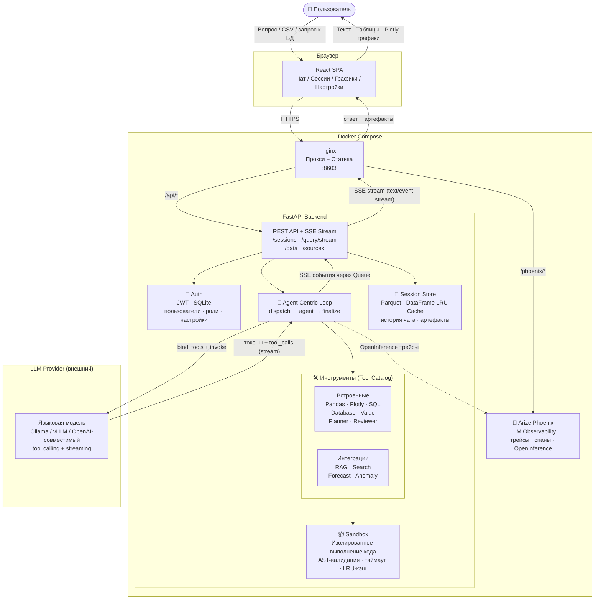

# Диаграмма 1 — Общая архитектура системы

Высокоуровневый обзор компонентов для заказчиков и менеджеров.

```mermaid
graph TD
    User(["👤 Пользователь"])

    subgraph Browser["Браузер"]
        UI["React SPA\nЧат / Сессии / Графики / Настройки"]
    end

    subgraph Docker["Docker Compose"]
        Nginx["nginx\nПрокси + Статика\n:8603"]

        subgraph Backend["FastAPI Backend"]
            Auth["🔐 Auth\nJWT · SQLite\nпользователи · роли · настройки"]
            API["REST API + SSE Stream\n/sessions · /query/stream\n/data · /sources"]
            Agent["🤖 Agent-Centric Loop\ndispatch → agent → finalize"]

            subgraph Tools["🛠 Инструменты (Tool Catalog)"]
                BuiltIn["Встроенные\nPandas · Plotly · SQL\nDatabase · Value\nPlanner · Reviewer"]
                Integrations["Интеграции\nRAG · Search\nForecast · Anomaly"]
            end

            Sandbox["📦 Sandbox\nИзолированное выполнение кода\nAST-валидация · таймаут · LRU-кэш"]
            Sessions["💾 Session Store\nParquet · DataFrame LRU Cache\nистория чата · артефакты"]
        end

        Phoenix["🔭 Arize Phoenix\nLLM Observability\nтрейсы · спаны · OpenInference"]
    end

    subgraph LLM["LLM Provider (внешний)"]
        Model["Языковая модель\nOllama / vLLM / OpenAI-совместимый\ntool calling + streaming"]
    end

    User -->|"Вопрос / CSV / запрос к БД"| UI
    UI -->|"HTTPS"| Nginx
    Nginx -->|"/api/*"| API
    Nginx -->|"/phoenix/*"| Phoenix
    API --> Auth
    API --> Sessions
    API --> Agent
    Agent -->|"bind_tools + invoke"| Model
    Model -->|"токены + tool_calls (stream)"| Agent
    Agent --> Tools
    Tools --> Sandbox
    Agent -->|"SSE события через Queue"| API
    API -->|"SSE stream (text/event-stream)"| Nginx
    Nginx -->|"ответ + артефакты"| UI
    UI -->|"Текст · Таблицы · Plotly-графики"| User
    Agent -.->|"OpenInference трейсы"| Phoenix
```
