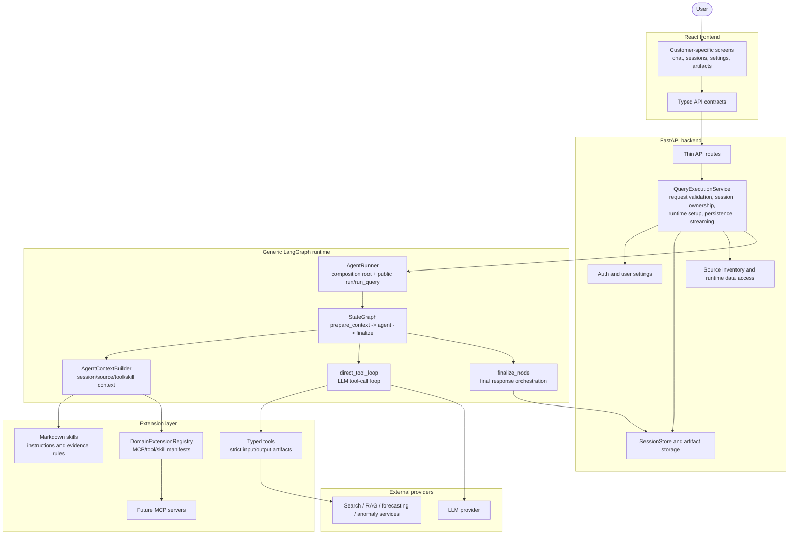

# Diagram 1 - System Architecture

High-level view of the current production architecture after the agent runtime
split. The important boundary is that the LangGraph runtime is a generic engine;
domain behavior enters through skills, typed tools, domain extension manifests,
and future MCP servers.

## Runtime Boundaries

- `backend/api/routes/query.py` is a thin FastAPI boundary. It delegates
  synchronous and streaming execution to `QueryExecutionService`.
- `QueryExecutionService` owns backend request concerns: auth/session checks,
  user settings, selected skills, tool permissions, source context, persistence,
  streaming callbacks, and fallback API responses.
- `AgentRunner` is the composition root for the generic runtime. It wires
  dependencies, compiles the graph, owns the small query cache, exposes
  `run(AgentRunRequest)`, and keeps `run_query(...)` as a compatibility adapter.
- The graph has three current nodes: `prepare_context`, `agent`, and `finalize`.
  It does not route chat/summary/report through keyword shortcuts.
- Domain behavior belongs in extension contracts: markdown skills, typed tools,
  domain extension manifests, and future MCP servers.
