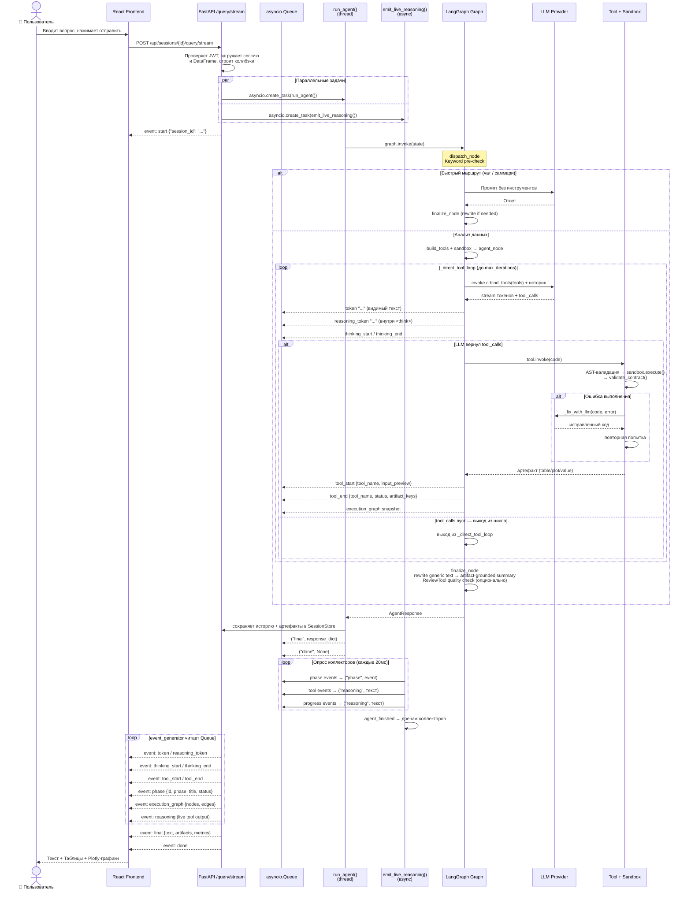

# Диаграмма 2 — Жизненный цикл запроса (Sequence Diagram)

Детальный поток от нажатия кнопки до получения ответа. Для разработчиков и технических заказчиков.

Два параллельных async task-а: `run_agent` выполняет граф агента в отдельном треде,
`emit_live_reasoning` опрашивает коллекторы и кладёт события в общую Queue.
`event_generator` читает Queue и отдаёт SSE клиенту.

