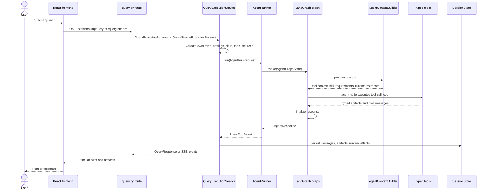

# Diagram 2 - Request Lifecycle

The query endpoints keep FastAPI concerns at the route boundary and hand the
runtime flow to `QueryExecutionService`.

## Streaming Path

For `/query/stream`, `prepare_stream(...)` runs before `StreamingResponse` is
created, so ownership and request setup errors remain normal HTTP errors. After
that, `stream_events(...)` owns the event loop and emits:

- `start`
- token and reasoning events from callbacks
- `tool_start` / `tool_end`
- `phase` and `execution_graph`
- `final`
- `done`

The route formats these service events as SSE. It does not build runtime state,
instantiate the agent directly, or call private runner methods.
