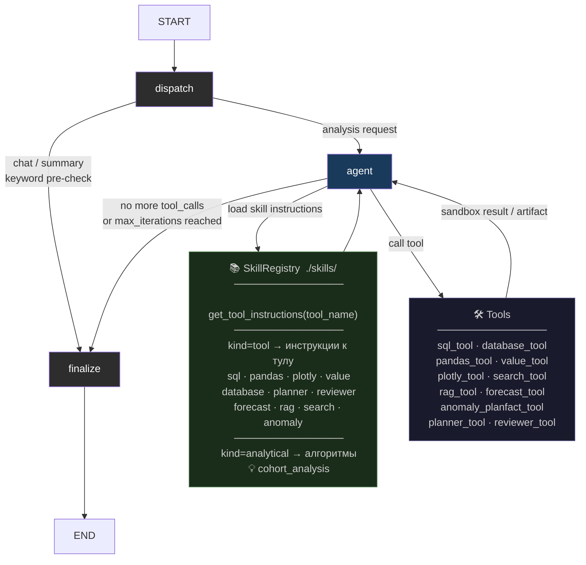

# Диаграмма 3 — Граф агента (Agent-Centric Loop)

Внутренняя логика LangGraph-графа. Для AI-инженеров и разработчиков.

```mermaid
flowchart TD
    START --> dispatch

    dispatch -->|"chat / summary\nkeyword pre-check"| finalize
    dispatch -->|"analysis request"| agent

    agent -->|"load skill instructions"| skills
    skills --> agent

    agent -->|"call tool"| tools
    tools -->|"sandbox result / artifact"| agent

    agent -->|"no more tool_calls\nor max_iterations reached"| finalize
    finalize --> END

    skills["📚 SkillRegistry  ./skills/
    ───────────────
    get_tool_instructions(tool_name)
    ───────────────
    kind=tool → инструкции к тулу
    sql · pandas · plotly · value
    database · planner · reviewer
    forecast · rag · search · anomaly
    ───────────────
    kind=analytical → алгоритмы
    💡 cohort_analysis"]

    tools["🛠 Tools
    ───────────────
    sql_tool · database_tool
    pandas_tool · value_tool
    plotly_tool · search_tool
    rag_tool · forecast_tool
    anomaly_planfact_tool
    planner_tool · reviewer_tool"]

    style dispatch fill:#2d2d2d,color:#fff
    style agent fill:#1a3a5c,color:#fff
    style finalize fill:#2d2d2d,color:#fff
    style skills fill:#1a2d1a,color:#ccc,stroke:#4a7a4a
    style tools fill:#1a1a2d,color:#ccc,stroke:#4a4a7a
```
