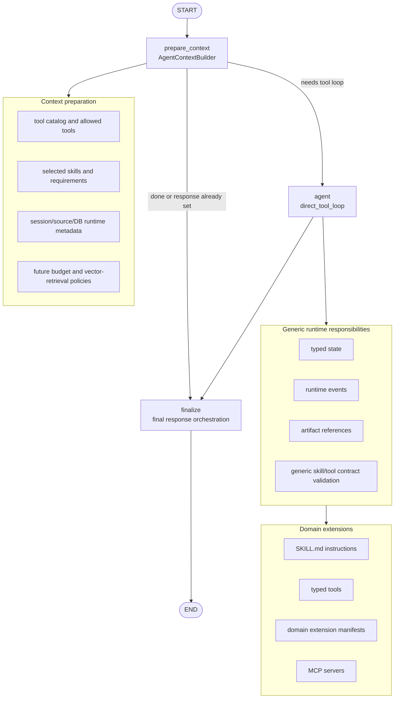

# Diagram 3 - Agent State Machine

Current LangGraph topology is intentionally small and domain-neutral.

## Node Responsibilities

- `prepare_context` builds generic context. It does not classify customer
  scenarios by keywords and does not short-circuit chat, summary, or reports.
- `agent` calls the LLM and executes typed tools through the generic tool loop.
- `finalize` performs generic final response orchestration and validation. It
  may append warnings for failed checks, but it must not replace good model
  answers with deterministic domain summaries.

New investment, sales, risk, forecasting, or customer-specific behavior should
enter through skills/tools/domain manifests/MCP, not by changing graph topology.
