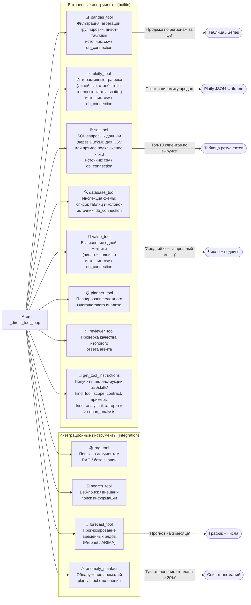

# Диаграмма 4 — Инструменты агента (Tool Catalog)

Полный список инструментов из `catalog.py`: встроенные и интеграционные. Для аналитиков и заказчиков.

```mermaid
graph LR
    Agent["🤖 Агент\n_direct_tool_loop"]

    subgraph Builtin["Встроенные инструменты (builtin)"]
        Pandas["📊 pandas_tool\nФильтрация, агрегации,\nгруппировки, пивот-таблицы\nисточник: csv / db_connection"]
        Plotly["📈 plotly_tool\nИнтерактивные графики\n(линейные, столбчатые,\nтепловые карты, scatter)\nисточник: csv / db_connection"]
        SQL["🗄 sql_tool\nSQL-запросы к данным\n(через DuckDB для CSV\nили прямое подключение к БД)\nисточник: csv / db_connection"]
        DB["🔍 database_tool\nИнспекция схемы:\nсписок таблиц и колонок\nисточник: db_connection"]
        Value["🔢 value_tool\nВычисление одной метрики\n(число + подпись)\nисточник: csv / db_connection"]
        Planner["📋 planner_tool\nПланирование сложного\nмногошагового анализа"]
        Reviewer["✅ reviewer_tool\nПроверка качества итогового\nответа агента"]
        GetInstructions["📖 get_tool_instructions\nПолучить .md инструкции из ./skills/\nkind=tool: scope, contract, примеры\nkind=analytical: алгоритм\n💡 cohort_analysis"]
    end

    subgraph Integrations["Интеграционные инструменты (integration)"]
        RAG["📚 rag_tool\nПоиск по документам\nRAG / база знаний"]
        Search["🔎 search_tool\nВеб-поиск / внешний\nпоиск информации"]
        Forecast["🔮 forecast_tool\nПрогнозирование\nвременных рядов\n(Prophet / ARIMA)"]
        Anomaly["⚠️ anomaly_planfact\nОбнаружение аномалий\nplan vs fact отклонения"]
    end

    Agent --> GetInstructions
    Agent --> Pandas
    Agent --> Plotly
    Agent --> SQL
    Agent --> DB
    Agent --> Value
    Agent --> Planner
    Agent --> Reviewer
    Agent --> RAG
    Agent --> Search
    Agent --> Forecast
    Agent --> Anomaly

    Pandas -->|"'Продажи по регионам за Q3'"| R1(["Таблица / Series"])
    SQL -->|"'Топ-10 клиентов по выручке'"| R2(["Таблица результатов"])
    Plotly -->|"'Покажи динамику продаж'"| R3(["Plotly JSON → iframe"])
    Value -->|"'Средний чек за прошлый месяц'"| R4(["Число + подпись"])
    Forecast -->|"'Прогноз на 3 месяца'"| R5(["График + числа"])
    Anomaly -->|"'Где отклонение от плана > 20%'"| R6(["Список аномалий"])
```
