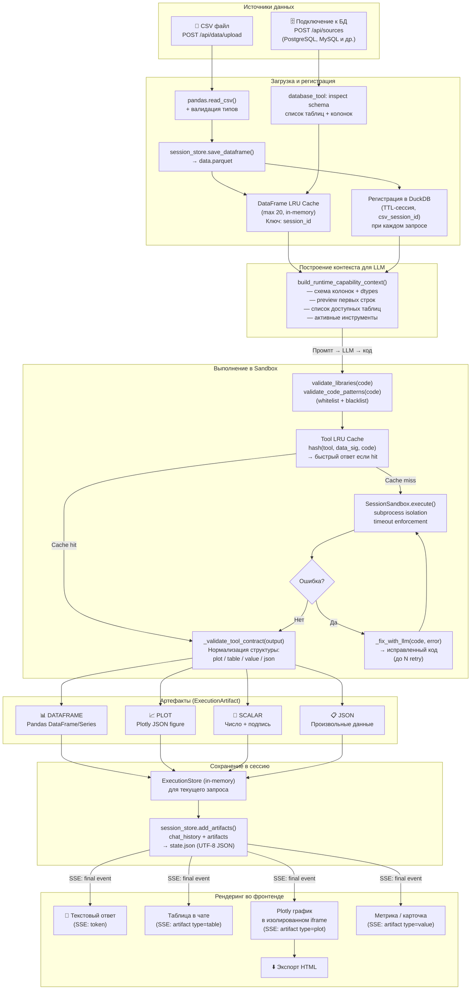

# Диаграмма 5 — Пайплайн данных

От загрузки источника до артефакта на экране. Для дата-инженеров и аналитиков.

```mermaid
flowchart TD
    subgraph Input["Источники данных"]
        CSV["📄 CSV файл\nPOST /api/data/upload"]
        DBConn["🗄 Подключение к БД\nPOST /api/sources\n(PostgreSQL, MySQL и др.)"]
    end

    subgraph Ingestion["Загрузка и регистрация"]
        ParseCSV["pandas.read_csv()\n+ валидация типов"]
        SaveParquet["session_store.save_dataframe()\n→ data.parquet"]
        DuckDB["Регистрация в DuckDB\n(TTL-сессия, csv_session_id)\nпри каждом запросе"]
        LRUCache["DataFrame LRU Cache\n(max 20, in-memory)\nКлюч: session_id"]
        DBSchema["database_tool: inspect schema\nсписок таблиц + колонок"]
    end

    subgraph ContextBuild["Построение контекста для LLM"]
        CapCtx["build_runtime_capability_context()\n— схема колонок + dtypes\n— preview первых строк\n— список доступных таблиц\n— активные инструменты"]
    end

    subgraph Execution["Выполнение в Sandbox"]
        Validate["validate_libraries(code)\nvalidate_code_patterns(code)\n(whitelist + blacklist)"]
        SandboxExec["SessionSandbox.execute()\nsubprocess isolation\ntimeout enforcement"]
        ContractCheck["_validate_tool_contract(output)\nНормализация структуры:\nplot / table / value / json"]
        ErrorFix{"Ошибка?"}
        LLMFix["_fix_with_llm(code, error)\n→ исправленный код\n(до N retry)"]
        CacheCheck["Tool LRU Cache\nhash(tool, data_sig, code)\n→ быстрый ответ если hit"]
    end

    subgraph Artifacts["Артефакты (ExecutionArtifact)"]
        ArtTable["📊 DATAFRAME\nPandas DataFrame/Series"]
        ArtChart["📈 PLOT\nPlotly JSON figure"]
        ArtMetric["🔢 SCALAR\nЧисло + подпись"]
        ArtJSON["📋 JSON\nПроизвольные данные"]
    end

    subgraph Persistence["Сохранение в сессию"]
        ExecStore["ExecutionStore (in-memory)\nдля текущего запроса"]
        SessionArtifacts["session_store.add_artifacts()\nchat_history + artifacts\n→ state.json (UTF-8 JSON)"]
    end

    subgraph Frontend["Рендеринг во фронтенде"]
        TextMsg["💬 Текстовый ответ\n(SSE: token)"]
        TableRender["Таблица в чате\n(SSE: artifact type=table)"]
        ChartRender["Plotly график\nв изолированном iframe\n(SSE: artifact type=plot)"]
        MetricRender["Метрика / карточка\n(SSE: artifact type=value)"]
        Export["⬇️ Экспорт HTML"]
    end

    CSV --> ParseCSV --> SaveParquet --> LRUCache
    SaveParquet --> DuckDB
    DBConn --> DBSchema --> LRUCache

    LRUCache --> CapCtx
    DuckDB --> CapCtx
    CapCtx -->|"Промпт → LLM → код"| Validate

    Validate --> CacheCheck
    CacheCheck -->|"Cache miss"| SandboxExec
    CacheCheck -->|"Cache hit"| ContractCheck
    SandboxExec --> ErrorFix
    ErrorFix -->|"Да"| LLMFix --> SandboxExec
    ErrorFix -->|"Нет"| ContractCheck

    ContractCheck --> ArtTable
    ContractCheck --> ArtChart
    ContractCheck --> ArtMetric
    ContractCheck --> ArtJSON

    ArtTable --> ExecStore --> SessionArtifacts
    ArtChart --> ExecStore
    ArtMetric --> ExecStore
    ArtJSON --> ExecStore

    SessionArtifacts -->|"SSE: final event"| TextMsg
    SessionArtifacts -->|"SSE: final event"| TableRender
    SessionArtifacts -->|"SSE: final event"| ChartRender
    SessionArtifacts -->|"SSE: final event"| MetricRender
    ChartRender --> Export
```
