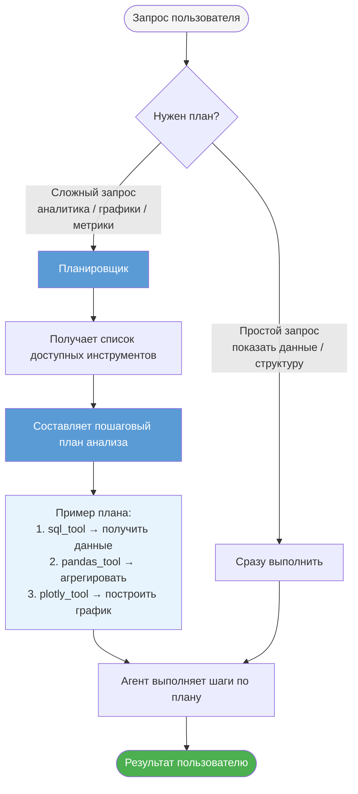

## Как работает планировщик анализа

Перед выполнением сложного запроса агент составляет пошаговый план — какие инструменты и в каком порядке использовать. Это позволяет избежать лишних шагов и добраться до результата кратчайшим путём.

## Когда планировщик включается

| Тип запроса | Планировщик | Пример |
|-------------|-------------|--------|
| Просмотр данных | Не нужен | «Покажи первые строки таблицы» |
| Веб-поиск | Не нужен | «Найди информацию о компании X» |
| Аналитика и метрики | Включается | «Какова динамика продаж за квартал?» |
| Графики и визуализация | Включается | «Построй график по регионам» |
| Прогнозы и сравнения | Включается | «Сравни план и факт за год» |
