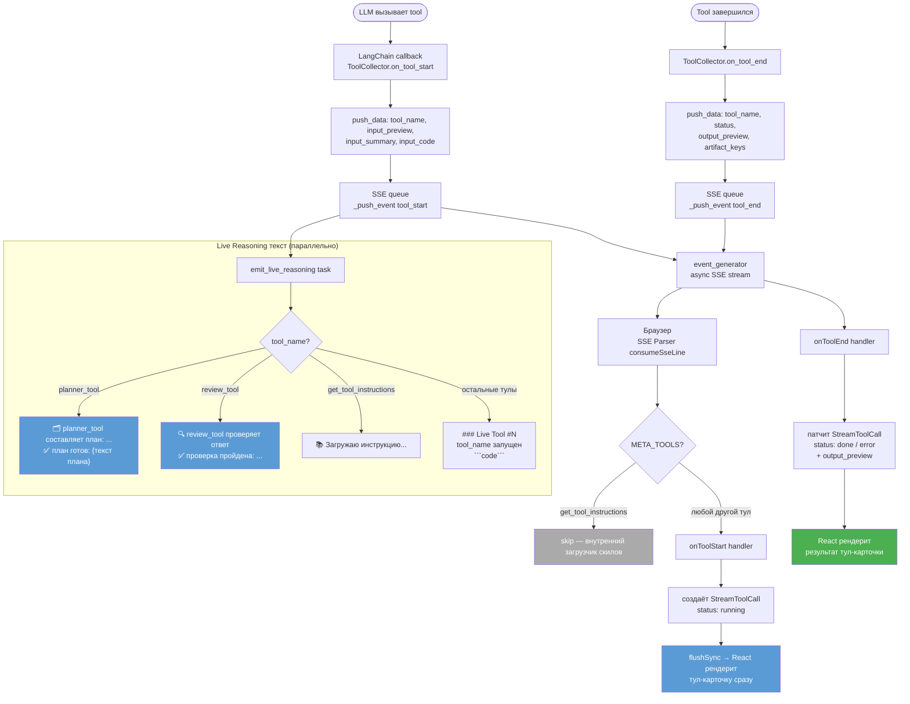

## Стриминг тул-вызовов на фронтенд

## Что видит пользователь для каждого тула

| Тул | Карточка в чате | input_summary | output_preview |
|-----|:--------------:|---------------|----------------|
| `planner_tool` | ✅ Да | вопрос пользователя | сгенерированный план |
| `review_tool` | ✅ Да | вопрос пользователя | результат проверки |
| `sql_tool` | ✅ Да | SQL-запрос | статус + артефакты |
| `pandas_tool` | ✅ Да | первая строка кода | статус + артефакты |
| `plotly_tool` | ✅ Да | первая строка кода | статус + артефакты |
| `get_tool_instructions` | ❌ Скрыт | — | — |

## Где были фильтры и что изменили

| Файл | Было | Стало |
|------|------|-------|
| `frontend/src/app/hooks/useChatAgent.ts:16` | `META_TOOLS = Set(["get_tool_instructions", "planner_tool", "review_tool"])` | `META_TOOLS = Set(["get_tool_instructions"])` |
| `frontend/src/app/hooks/useChatAgent.ts:24` | нет обработки `question` / `answer` | добавлены поля для planner / review |
| `backend/api/routes/query.py:562` | компактный emoji для planner+review | полноценный текст с вопросом и планом |
| `backend/agent/callbacks.py:261` | нет `question` / `answer` в `_build_input_summary` | добавлены |
