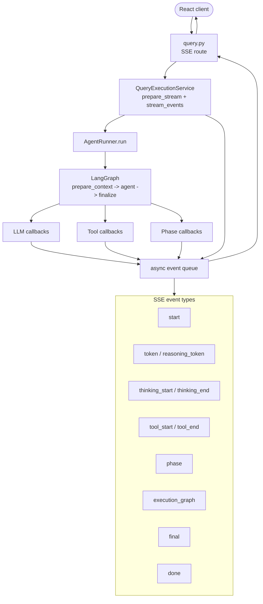

# Diagram 9 - Thinking and Runtime Events

Streaming events are backend service concerns. The graph and tool loop emit
typed runtime information through callbacks; `QueryExecutionService` converts
that into SSE events for the frontend.

## Event Rules

- The frontend consumes public SSE event payloads only. It must not depend on
  private runner methods or graph internals.
- Thinking visibility is controlled by user settings and provider policy.
- Tool events describe typed tool calls and artifact references; they should not
  encode customer-specific business logic.
- Runtime fallback responses are API/service-level safety behavior. Domain
  recovery belongs in typed tools, skills, or extension services.
