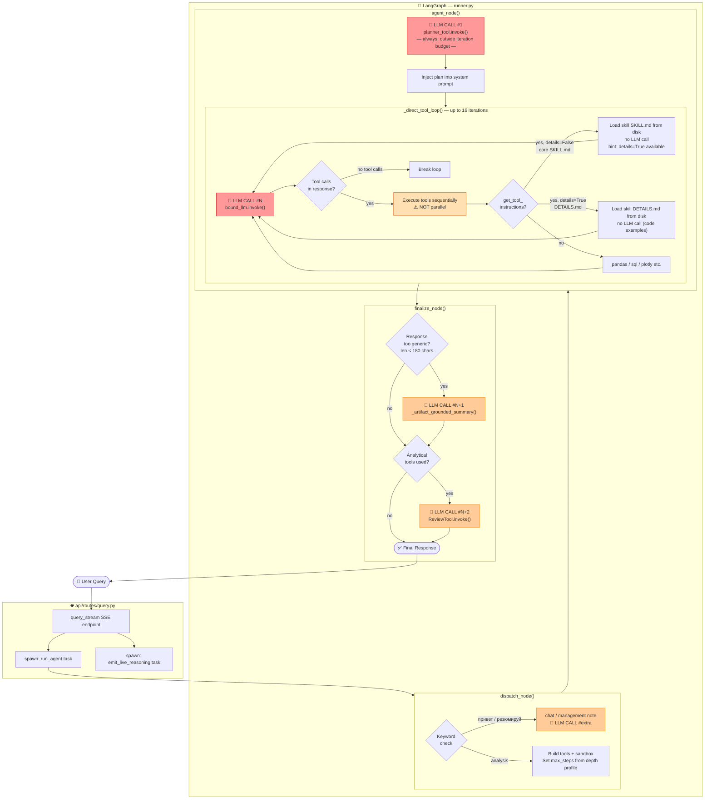

```mermaid
flowchart TD
    USER([👤 User Query]) --> STREAM

    subgraph API["🌐 api/routes/query.py"]
        STREAM[query_stream SSE endpoint]
        STREAM --> TASK1[spawn: run_agent task]
        STREAM --> TASK2[spawn: emit_live_reasoning task]
    end

    subgraph GRAPH["🔀 LangGraph — runner.py"]
        TASK1 --> DISPATCH

        subgraph DISPATCH["dispatch_node()"]
            D1{Keyword\ncheck}
            D1 -->|"привет / резюмируй"| CHAT[chat / management note\n🧠 LLM CALL #extra]
            D1 -->|analysis| D2[Build tools + sandbox\nSet max_steps from depth profile]
        end

        DISPATCH --> AGENT

        subgraph AGENT["agent_node()"]
            A1["🧠 LLM CALL #1\nplanner_tool.invoke()\n— always, outside iteration budget —"]
            A1 --> A2[Inject plan into system prompt]
            A2 --> LOOP
        end

        subgraph LOOP["_direct_tool_loop() — up to 16 iterations"]
            L1["🧠 LLM CALL #N\nbound_llm.invoke()"]
            L1 --> L2{Tool calls\nin response?}
            L2 -->|yes| L3[Execute tools sequentially\n⚠️ NOT parallel]
            L3 --> L4{get_tool_\ninstructions?}
            L4 -->|"yes, details=False\ncore SKILL.md"| L5["Load skill SKILL.md from disk\nno LLM call\nhint: details=True available"]
            L4 -->|"yes, details=True\nDETAILS.md"| L5D["Load skill DETAILS.md from disk\nno LLM call (code examples)"]
            L4 -->|no| L6[pandas / sql / plotly etc.]
            L5 --> L1
            L5D --> L1
            L6 --> L1
            L2 -->|no tool calls| DONE[Break loop]
        end

        LOOP --> FINALIZE

        subgraph FINALIZE["finalize_node()"]
            F1{Response\ntoo generic?\nlen < 180 chars}
            F1 -->|yes| F2["🧠 LLM CALL #N+1\n_artifact_grounded_summary()"]
            F1 -->|no| F3
            F2 --> F3
            F3{Analytical\ntools used?}
            F3 -->|yes| F4["🧠 LLM CALL #N+2\nReviewTool.invoke()"]
            F3 -->|no| FINAL
            F4 --> FINAL
        end
    end

    FINAL([✅ Final Response]) --> USER

    style A1 fill:#ff9999,stroke:#cc0000
    style L1 fill:#ff9999,stroke:#cc0000
    style F2 fill:#ffcc99,stroke:#ff8800
    style F4 fill:#ffcc99,stroke:#ff8800
    style CHAT fill:#ffcc99,stroke:#ff8800
    style L3 fill:#ffe0b2,stroke:#e65100
```