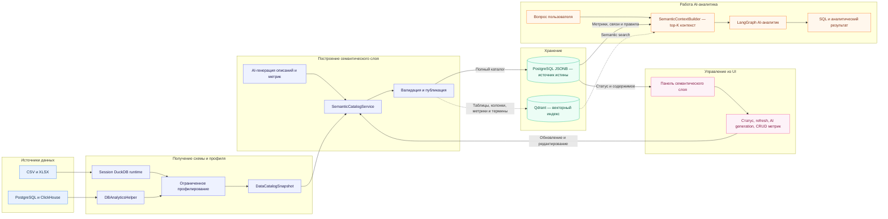

# Диаграмма 10 — Семантический слой

Презентационная схема: как физические данные превращаются в бизнес-контекст для AI-аналитика.

## Как объяснять на презентации

1. Файл загружается в session DuckDB runtime, внешняя БД читается через `DBAnalyticsHelper`.
2. Профилирование ограничено sample, timeout и лимитами, поэтому не выполняет полный scan больших источников.
3. `SemanticCatalogService` объединяет физическую схему, эвристики, пользовательские правки и AI-генерацию.
4. Полный каталог хранится в PostgreSQL; Qdrant содержит только индекс для semantic search.
5. На вопрос пользователя `SemanticContextBuilder` выбирает top-K объектов, после чего AI строит SQL с учётом метрик, синонимов и связей.
