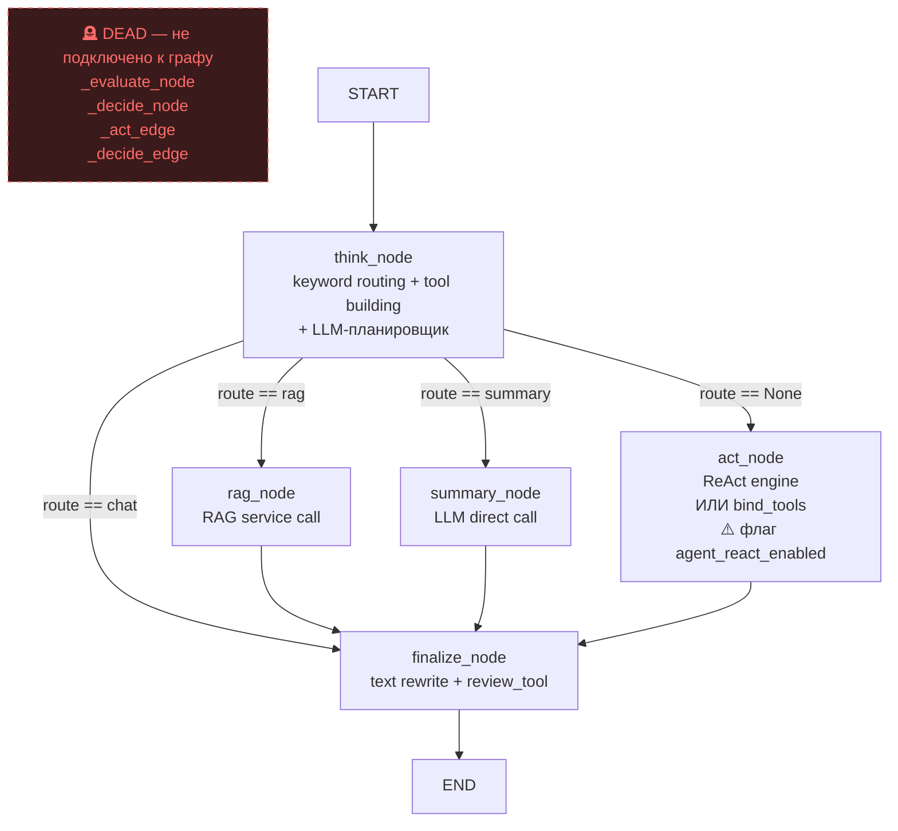
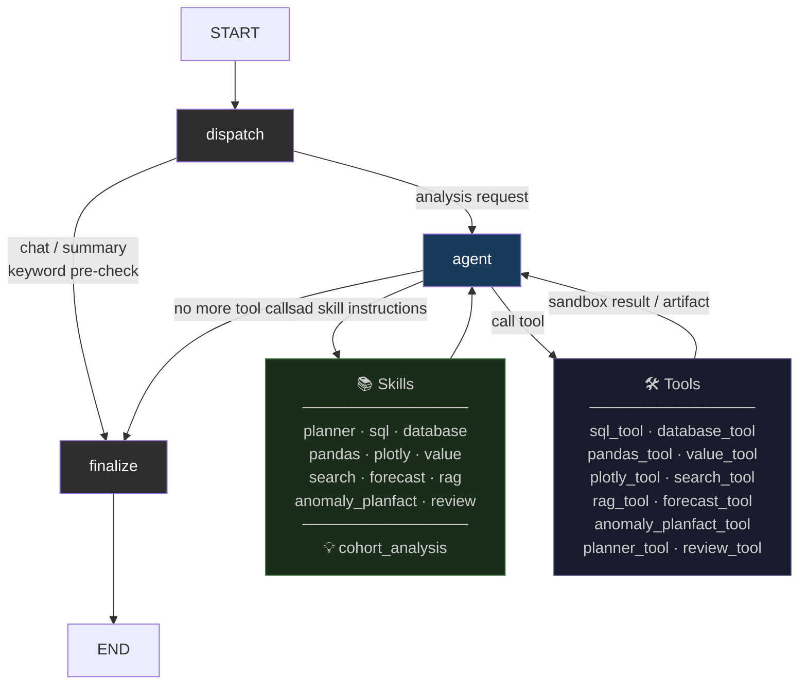

# Рефакторинг архитектуры агента

## Что было

Старый граф выполнения:

- `_evaluate_node`, `_decide_node`, `_act_edge`, `_decide_edge` — мёртвый код,
  существовал как методы, но никогда не был подключён к скомпилированному графу
- `think_node` делал одновременно: keyword-routing, построение tools, вызов LLM-планировщика —
  три разные роли под одним именем
- `rag_node` и `summary_node` — отдельные узлы графа с дублирующей логикой
- Два конкурирующих execution engine: ReAct (`create_pandas_dataframe_agent`) и
  direct tool-calling (`bind_tools`) за флагом `agent_react_enabled`
- `agent_prompt` — мёртвый промпт (109 строк), не подключённый ни к одному узлу

## Что изменилось

| Было | Стало |
|------|-------|
| 7+ узлов графа, часть мёртвых | 3 узла: `dispatch → agent → finalize` |
| Два execution engine за флагом | Один: `bind_tools` / `_direct_tool_loop` |
| `agent_react_enabled` в config, БД, API | Флаг удалён из runtime полностью |
| System prompt собирался в 3 местах | Один метод `_build_execution_system_prompt` |
| `agent_prompt`, `_evaluate_node` и др. | Удалены вместе с 3 файлами legacy-агента |
| Skills-файлы не интегрированы в промпт | Инжектируются в system prompt через registry |

## Новая архитектура

**`dispatch`** — детерминированный keyword pre-check (без LLM). Три лёгких bypass'а:
- `chat` — приветствия, вопросы о боте
- `summary` — управленческая записка по итогам сессии

Всё остальное → строит `tools`, `sandbox`, `capability_context` и передаёт в `agent`.

**`agent`** — единственный execution engine: нативный tool-calling через `bind_tools`.
Получает полный system prompt (policy + skills + data context) и гоняет tool loop
до тех пор, пока LLM не вернёт финальный текст без вызовов.

**`finalize`** — перезаписывает ответ если нужно, запускает `review_tool` для
проверки качества.

## Удалено

- `backend/agent/agent.py` — старый монолитный `Agent` класс (ReAct)
- `backend/agent/agent_callback.py` — legacy callback handlers
- `backend/agent/pandas_agent.py` — `create_pandas_dataframe_agent` и обвязка
- Мёртвые методы: `_evaluate_node`, `_decide_node`, `_act_edge`, `_decide_edge`,
  `_analysis_step`, `_rag_node`, `_summary_node`, `_think_system_prompt`
- Конфиг-флаги: `agent_react_enabled`, `agent_evaluate_enabled`, `agent_evaluate_max_tokens`
- Мёртвый промпт `agent_prompt` (109 строк)
- Null-паттерны `NoOpSkillFilter`, `NullSkillMatcher`, `NullSkillRanker`
